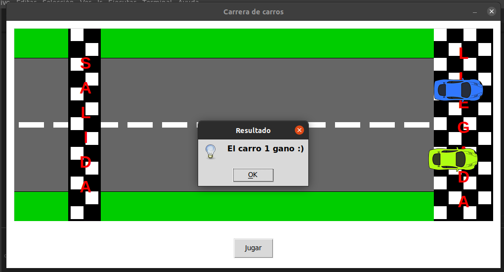

# PARCIAL 2 - FUNDAMENTOS PROGRAMACION - 2023-I

Junto a su compañero de trabajo, desarrollo una app en Python que permita simular la competencia de dos carros, como se observa en la imágen.

- Los carros son dos imágenes en formato png que deben buscar en internet, los cuales al ejecutar la aplicación están ubicados en el punto de salida.

- La pista debe ser dibujada haciendo uso de las distintas funciones del objeto Canvas.

- En el Frame de Controles se agrega un botón, de tal forma que al hacer click sobre él, se inicia la competencia de los dos carritos.

- Una vez se hace click sobre el botón, cada carro adquiere una velocidad aleatoria y comienzan a desplazarse hacia la derecha, de tal forma que cuando el primero de ellos alcance el punto de llegada se indica mediante una ventana emergente que ha sido el campeón.

